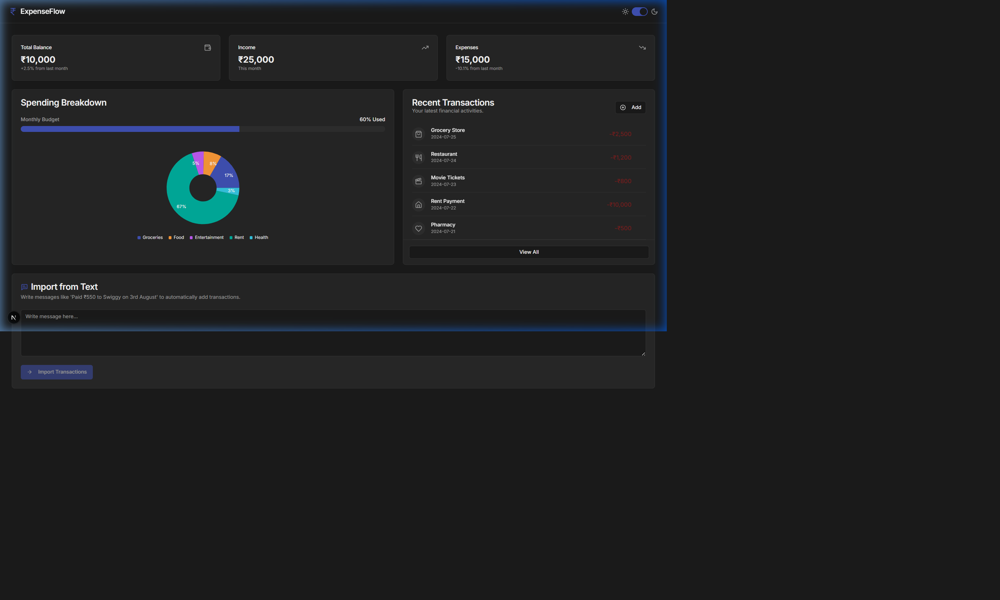
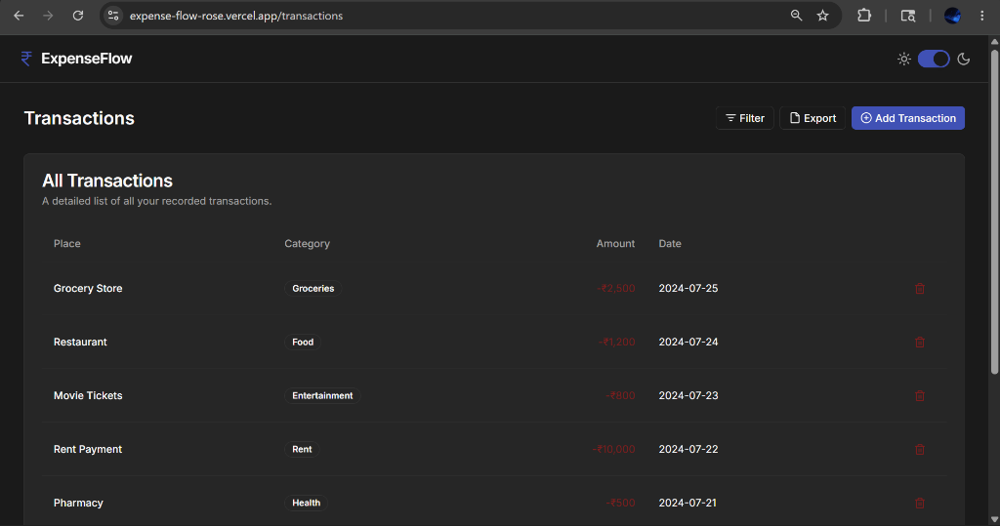

<p align="center">
  
  
  
  
</p>

# ExpenseFlow

A modern, AI-powered personal finance dashboard built with Next.js 15 and Firebase Genkit. Track expenses, visualize spending patterns, and effortlessly import transactions using natural language—all in a polished, responsive interface with seamless dark and light theme support.

**Live Demo:** [https://expense-flow-rose.vercel.app](https://expense-flow-rose.vercel.app)

---

## Screenshots

<p align="center">
  
</p>
<p align="center"><em>Dashboard View (Dark Mode)</em></p>

<p align="center">
  
</p>
<p align="center"><em>Transactions List View (Dark Mode)</em></p>

---

## What is ExpenseFlow?

ExpenseFlow is an intelligent personal finance tracker designed to eliminate the friction of logging daily expenses. Instead of manually filling out tedious forms for every purchase, ExpenseFlow leverages AI to parse natural language input. 

Whether you're pasting a bank SMS, typing a quick note, or copying an email receipt, ExpenseFlow instantly structures the data and updates your dashboard.

### How Does It Work?

1. **Dashboard & Visualization**: The main dashboard gives you a bird's-eye view of your finances. It calculates your total balance, income, and expenses, while the dynamic Recharts pie chart visualizes where your money is going based on category.
2. **AI Transaction Extraction**: The core magic happens in the "Import from Text" feature. We use **Firebase Genkit** powered by **Google AI (Gemini)** to process unstructured text.
3. **Smart Autocomplete**: When manually adding a transaction, an AI flow suggests potential merchants based on your partial input (e.g., typing "Star" suggests "Starbucks").

---

## How We Extract Transactions

The transaction extraction is powered by a server-side AI flow built with **Firebase Genkit**:

1. **User Input**: The user pastes a text message like: *"Paid ₹550 to Swiggy on 3rd August"* into the UI.
2. **Genkit Flow**: This text is sent securely to our `extractTransactionsFromText` Genkit flow.
3. **LLM Parsing**: A highly-tuned prompt instructs the Google AI model to act as a financial data parser. It identifies:
   - **Place/Description** (e.g., "Swiggy")
   - **Amount** (e.g., 550)
   - **Date** (e.g., "YYYY-08-03" relative to the current year)
   - **Type** (Debit or Credit)
4. **Structured Output**: The AI guarantees the output matches a strict **Zod schema**, returning a perfectly formatted JSON array of transactions.
5. **State Update**: The React frontend receives the structured data, assigns the correct icons based on the category, and instantly updates the dashboard charts and lists.

---

## Features

- **Financial Dashboard** — At-a-glance view of total balance, income, and expenses with trend indicators.
- **Spending Breakdown** — Interactive donut chart powered by Recharts for category-wise spending visualization.
- **Budget Progress** — Visual progress bar showing monthly budget usage percentage.
- **Transaction Management** — Add, view, filter, and delete transactions with categorized icons.
- **Natural Language Import** — Paste messages to auto-create transactions via Genkit AI.
- **Smart Merchant Suggestions** — AI-driven autocomplete when adding new transactions.
- **Dark / Light Theme** — Seamless theme toggle with system preference detection.
- **Responsive Design** — Optimized layout for desktop, tablet, and mobile screens.

---

## Tech Stack

| Layer | Technology |
|---|---|
| **Framework** | Next.js 15 (App Router) |
| **Language** | TypeScript 5 |
| **Styling** | Tailwind CSS 3 + shadcn/ui components |
| **Charts** | Recharts |
| **AI / LLM** | Firebase Genkit + Google AI |
| **UI Primitives** | Radix UI |

---

## Getting Started (Local Development)

### Prerequisites

- **Node.js** 18+ and **npm**
- A **Google AI API key** (for Genkit AI features)

### Installation

```bash
# Clone the repository
git clone https://github.com/meghanasingareddy/ExpenseFlow.git
cd ExpenseFlow

# Install dependencies
npm install

# Set up environment variables
cp .env.example .env.local
# Add your GOOGLE_API_KEY to .env.local

# Start the development server
npm run dev
```

The app will be available at [http://localhost:9002](http://localhost:9002).

---

## Deployment

This project is deployed on **Vercel** at [expense-flow-rose.vercel.app](https://expense-flow-rose.vercel.app). 
To deploy your own instance, connect your GitHub repository to Vercel and ensure the `GOOGLE_API_KEY` is added to your Vercel Environment Variables.

---

## License

This project is open source and available under the [MIT License](LICENSE).
